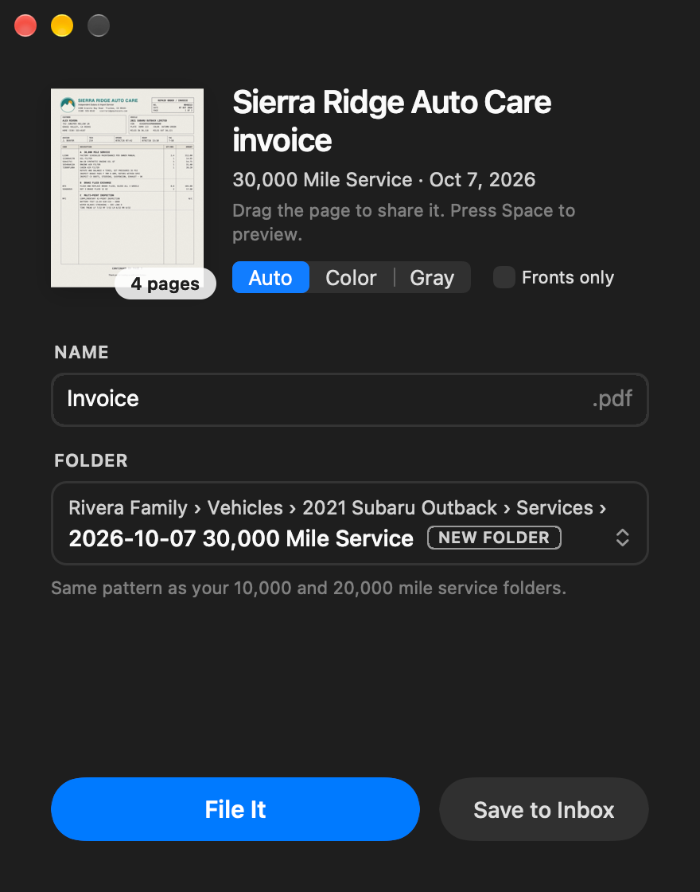
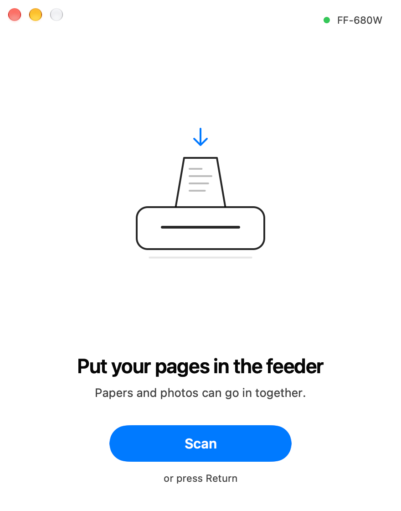
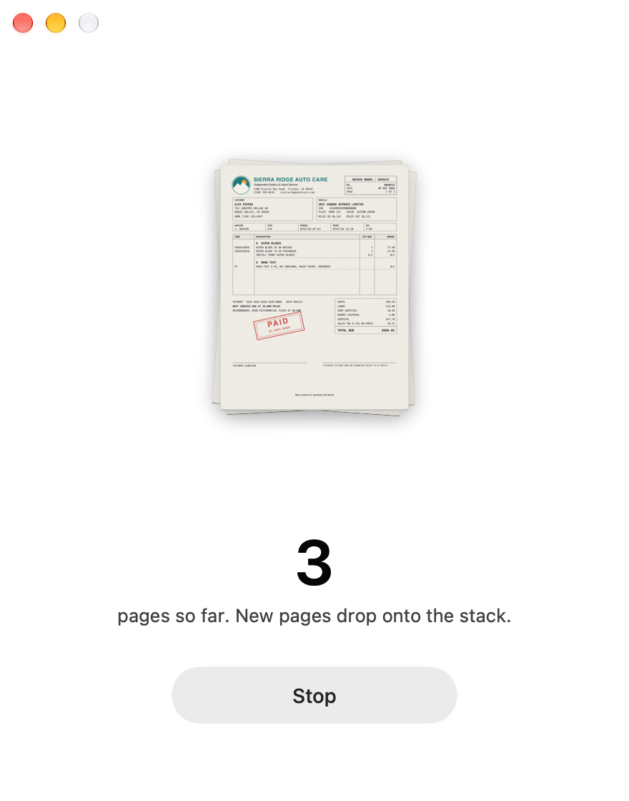
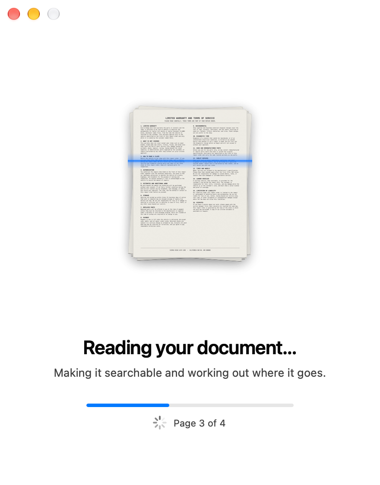
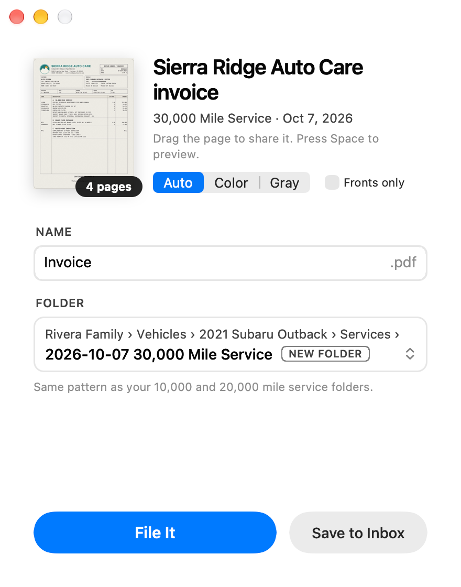
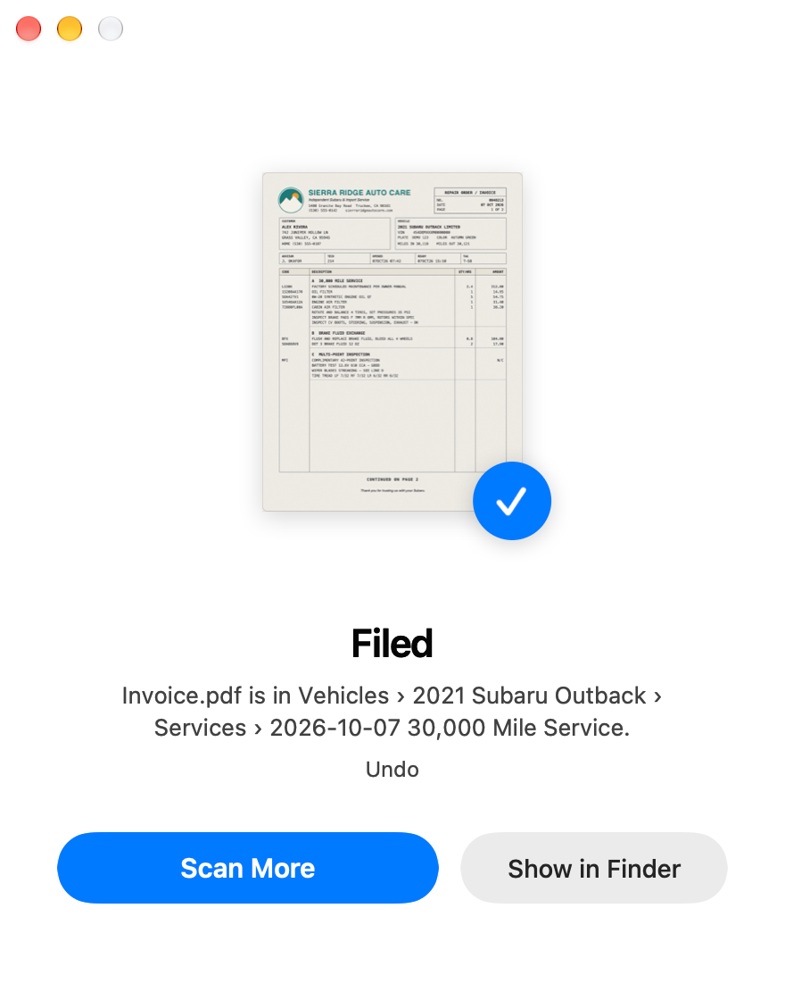
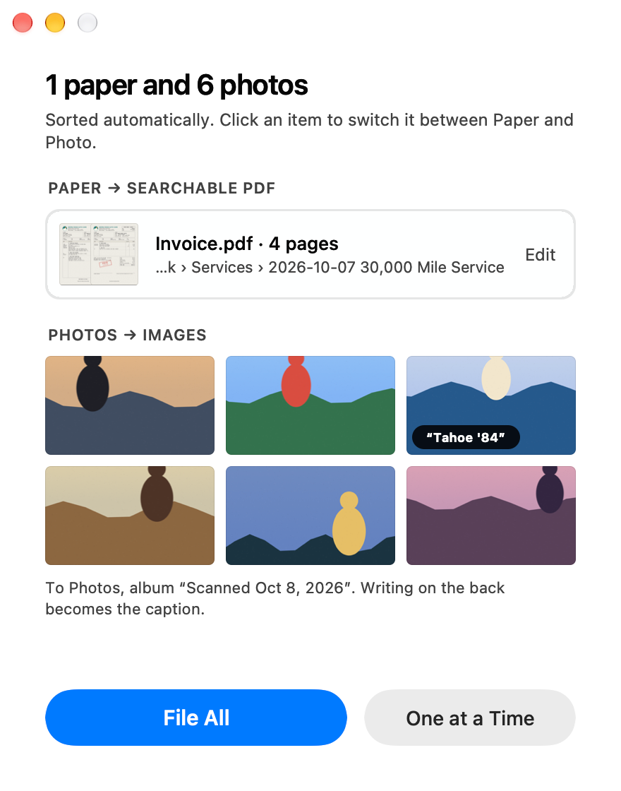

# FastScan

**Put a stack in the feeder, press Scan, and it's filed where it belongs.**

FastScan replaces Epson's software for the FastFoto FF-680W with one native Mac window that does one job well. Papers become searchable PDFs, photos go to Apple Photos, and on-device AI names each document and picks its folder the way your family already organizes things.

<p align="center">
  
</p>

## Features

- **No setup, no settings to fiddle with.** It finds the scanner on your Wi-Fi by itself. There is one button: Scan.
- **Papers and photos in one stack.** Each sheet is sorted into paper or photo automatically. Click any item to switch it.
- **Files itself, with your say-so.** On-device AI reads the document and suggests a name and folder that follow your existing patterns, such as `Vehicles/…/Services/2026-10-07 30,000 Mile Service/Invoice.pdf`. It shows why it chose them, and nothing is written until you press File It. Undo puts it back.
- **Searchable PDFs.** Every page is cropped to the paper and run through OCR, so you can search and select its text in Finder, Spotlight, and Preview.
- **Clean output.** Blank backs disappear. Paper with no real color is stored in crisp grayscale at about 1 MB per page or less.
- **Change your mind after scanning.** Switch a document between color and grayscale, or keep only the fronts, without scanning again.
- **Photos with their stories.** Photos land in an album in Apple Photos, and handwriting on the back becomes the caption.
- **Forgiving.** A paper jam keeps the pages already scanned, and Scan the Rest adds the remainder to the same document.

## The flow

<table>
  <tr>
    <td width="33%" valign="top"><br><b>Ready.</b> FastScan finds the scanner on its own. Load the feeder and press Scan.</td>
    <td width="33%" valign="top"><br><b>Scanning.</b> Each page drops onto the stack as it comes out of the feeder.</td>
    <td width="33%" valign="top"><br><b>Reading.</b> Pages are cropped and read with OCR. Then FastScan works out where the document goes.</td>
  </tr>
  <tr>
    <td width="33%" valign="top"><br><b>File.</b> The suggested name and folder, with the reason. Nothing is written until you press File It.</td>
    <td width="33%" valign="top"><br><b>Filed.</b> The PDF is in its folder. Undo moves it back out.</td>
    <td width="33%" valign="top"><br><b>Papers and photos.</b> A mixed stack is sorted for you. Photos go to an album in Apple Photos.</td>
  </tr>
</table>

The screenshots use a made-up invoice and family folder.

## How it works

FastScan drives the scanner through SANE's `epsonds` backend, which ships inside the app. It crops each page, drops blank sides, and reads the text with Vision. Apple's Foundation Models framework then chooses a destination from the folders that best match the page.

## Download

Get the latest `FastScan-<version>.zip` from [Releases](https://github.com/dewski/fastscan/releases). It needs a Mac with Apple silicon on macOS 26 or later and an Epson FastFoto FF-680W on your Wi-Fi. Nothing else needs to be installed: the app carries its own copy of SANE, and it is signed with a Developer ID and notarized by Apple, so it opens like any other downloaded app. The release notes walk through the first launch.

## Requirements

These are for building FastScan. People who download the app need only macOS 26 or later on Apple silicon.

- macOS 26 or later on Apple silicon, Xcode 27. Filing suggestions use Apple Intelligence (Foundation Models) when it is available, and a built-in heuristic when it isn't. Photos captions go into Photos' caption field on macOS 27.
- Homebrew packages `sane-backends`, `jpeg-turbo`, and `xcodegen`:

  ```sh
  brew install sane-backends jpeg-turbo xcodegen
  ```

  Homebrew is needed only to build. SwiftPM reads `sane.h` from `sane-backends`, and the `scankit` CLI links Homebrew's `libsane`. The app does not: `script/build` bundles its own SANE, as described below.
- Network access on the first build, to download the SANE source tarball.

The app finds the scanner over Bonjour (`_scanner._tcp`) and writes its own SANE config to `~/Library/Application Support/FastScan/sane.d`, so you don't need to edit `/opt/homebrew/etc/sane.d`.

## Build and run the app

```sh
script/install
```

`script/install` builds the app, replaces `/Applications/FastScan.app`, and opens it. Use `script/build` alone to build into `build/FastScan.app` without installing.

On first launch macOS asks whether FastScan may find devices on the local network. Choose **Allow**. If the window says it can't find the scanner, use **Allow FastScan on your local network…** to open the setting.

`script/build` generates `FastScan.xcodeproj` from `project.yml` and builds a Release app at `build/FastScan.app`. Then it:

1. Runs `script/build-sane`, which builds `libsane` from the pinned sane-backends 1.4.0 tarball for macOS 26, with only the `epsonds` backend compiled into it. Nothing is loaded at run time with `dlopen`. The build is cached in `build/sane` until the tarball or the script changes. Homebrew's own `epsonds` is not used, because its bottle needs macOS 27.
2. Runs `script/bundle-sane`, which copies that `libsane` and Homebrew's `libjpeg` into `Contents/Frameworks` and points the app at them through `@rpath`.
3. Runs `script/sign`, which signs each library and then the app with one identity. The default is ad hoc, without the hardened runtime: library validation refuses ad hoc libraries, because ad hoc code has no Team ID. Set `FASTSCAN_SIGN_IDENTITY` to sign with a real identity, which turns on the hardened runtime.
4. Runs `script/check-bundle`, which fails if any Mach-O in the app loads from `/opt/homebrew` or `/usr/local`, or needs a newer macOS than the app.

`script/check-bundled-sane` proves the bundled SANE works without Homebrew. It runs `scankit info` against the app's libraries, in a sandbox that denies every read under `/opt/homebrew` and `/usr/local`.

### Releases

A release must be signed with a Developer ID and notarized, or macOS blocks it on other Macs. Set up both once:

1. In Xcode, open **Settings › Accounts › Manage Certificates** and add a **Developer ID Application** certificate.
2. Store notarization credentials in the keychain as the profile `fastscan-notary`. Use an app-specific password for your Apple Account:

   ```sh
   xcrun notarytool store-credentials fastscan-notary --apple-id <apple-id> --team-id <team-id>
   ```

To cut a release, set `MARKETING_VERSION` in `project.yml`, update `docs/release-notes.md`, commit, and run `script/release --publish`. It builds and signs the app with the Developer ID and the hardened runtime, sends it to Apple's notary service, staples the ticket, and checks it with `spctl`. Then it zips the app into `dist/` with a SHA-256 checksum and creates the GitHub release `v<version>`, with the SANE source tarball and `script/build-sane` attached. Without `--publish` it only packages. `FASTSCAN_SIGN_IDENTITY` picks the identity when the keychain has more than one Developer ID.

`script/release --unsigned` makes an ad hoc build without notarization. macOS blocks its first launch until the user clicks **Open Anyway**. Without `--unsigned`, `script/release` stops if the Developer ID or the `fastscan-notary` profile is missing.

FastScan bundles SANE and libjpeg-turbo. Their licenses are in `THIRD-PARTY-NOTICES.md`, which the app shows under **FastScan › Acknowledgements**. Run `script/third-party-notices` to regenerate it after either version changes. `script/bundle-sane` refuses to bundle a Homebrew library version that the notices don't name.

## Use the app

1. Put papers and photos in the feeder together, and press **Scan** or Return. Every sheet is scanned on both sides at 300 dpi in color. Blank sides are dropped, and every other side is kept until you file.
2. FastScan reads the pages and works out where they go.
3. For a document, the filing card shows the suggested name and folder, and a one-line reason. Edit the name, or use the folder row to search all folders. A new dated event folder, such as `2026-10-07 30,000 Mile Service`, is marked NEW FOLDER. Drag the page thumbnail to share the PDF, or press Space to preview it. Under the title, **Auto / Color / Gray** sets how this document's pages are stored. Auto keeps color only for pages that have it, such as a stamp. Changing it re-encodes the pages from the scan, without scanning again. When a sheet has something on its back, such as printed terms, **Fronts only** beside it leaves the backs out of the PDF. Turn it off to put them back. The suggested name and folder stay the same either way.
4. Press **File It**, or **Save to Inbox** to sort it later. Nothing is written to the filing cabinet until you press one of these.
5. **Undo** on the Filed screen, or ⌘Z, moves the file back out. It also removes the new folder if the folder is empty again.

When a batch has photos, a review screen shows papers and photos side by side. Click any item to switch it between paper and photo. **File All** files the document and adds the photos to Photos in an album named `Scanned Oct 7, 2026`. Writing on the back of a photo becomes its caption.

If the feeder jams, the pages scanned so far are kept. **Scan the Rest** adds the remaining pages to the same document.

Settings (⌘,) holds the filing cabinet folder, what to do when FastScan is unsure, and the color each document starts with. The filing cabinet defaults to `~/Documents/Scans`, which FastScan creates if it is missing. Choose your own folder, such as a shared family folder in iCloud Drive, in Settings. When unsure, the folder starts as `<cabinet>/Inbox`, which FastScan creates the first time it is used.

## How suggestions work

1. `FolderIndex` lists the cabinet's folders and a few file names in each, from directory metadata only. It is cached in Application Support and rebuilt in the background at launch.
2. `CandidateRanker` scores every folder against the OCR text. It looks at rare shared words, the vehicle a VIN decodes to, and sibling event folders that follow the document's own pattern. For example, `10,000 Mile Service` matches a paper that says `30,000 MILE SERVICE`.
3. `FilingSuggester` gives the best 25 folders to the on-device model. A runtime schema limits the model's destination to those folders. The model names a new event folder and the file.
4. If the model is unavailable, slow, or fails, `HeuristicSuggester` gives the best-ranked folder and a name in the family's own patterns.
5. When you change the folder or the name, the change is saved in `~/Library/Application Support/FastScan/feedback.json`. Future prompts include it as an example.

## Command-line tool

The `scankit` CLI runs the same code without the app. Images are a duplex scan in feeder order (front, back, front, back) at 300 dpi.

```sh
swift run scankit discover                                  # list scanners found over Bonjour
swift run scankit suggest a.png b.png --root <cabinet>      # kinds, candidates, suggestion, stored page sizes
swift run scankit file a.png b.png --root <cabinet> --receipt r.json   # file into a test cabinet
swift run scankit undo r.json                               # move it back out
swift run scankit scan --root <cabinet>                     # scan the feeder and suggest; never files
```

`suggest` and `scan` take `--no-model` to use the heuristic only. `suggest`, `file`, and `process` take `--color automatic|color|grayscale`, and `suggest` and `file` take `--fronts-only` to leave out the back of each sheet after reading it. The suggestion still reads every side. `file` refuses any cabinet inside iCloud Drive and never adds to Photos.

## Testing against the family's folder safely

Never point a test or the CLI at the live shared folder. Mirror its shape instead:

```sh
script/mirror-tree "$HOME/Library/Mobile Documents/com~apple~CloudDocs/Rivera Family" "/tmp/cabinet/Rivera Family"
```

This copies every folder and makes a zero-byte file for every file. It reads the source and nothing else. Run the app against the mirror with `FASTSCAN_ROOT=<mirror>`. Set `FASTSCAN_PHOTOS_DRYRUN=<dir>` to write photos to a folder instead of Photos.

## Test

```sh
swift test
```

The tests use synthetic images and temporary folder trees. Two groups are opt-in. The first reads the rendered demo invoice with OCR and ranks it in the demo cabinet. The second runs the on-device model:

```sh
script/render-demo-pages /tmp/demo/pages && script/demo-cabinet /tmp/demo
FASTSCAN_FIXTURES=/tmp/demo/pages FASTSCAN_MIRROR="/tmp/demo/Rivera Family" swift test
FASTSCAN_MODEL_TESTS=1 swift test
```

`script/verify-fixtures` runs the demo pages through the page pipeline and checks that the PDF is searchable.

`script/render-demo-pages <dir>` draws a fictional two-sheet service invoice as scanner pages. `script/demo-cabinet <dir>` creates a fictional family cabinet, `Rivera Family`, for it to file into. `script/readme-screenshots` uses both to regenerate `docs/screenshots`:

```sh
script/build
script/readme-screenshots
```

To render every screen in light and dark mode with other data:

```sh
script/build
FASTSCAN_FIXTURES=/path/to/scans FASTSCAN_ROOT=/path/to/mirror script/snapshot-screens /tmp/screens
```

`FASTSCAN_DEMO=<screen>` opens the app on one screen. `FASTSCAN_SNAPSHOT=<file.png>` writes the window to a PNG. These work without screen-recording permission.

Scans and PDFs contain personal data. `.gitignore` excludes `*.png` and `*.pdf` except the app icon and `docs/screenshots`. Only fictional data goes in `docs/screenshots`.

## Layout

- `Sources/CSANE` wraps `sane.h` and `libsane`. SwiftPM builds link Homebrew's `libsane`, and `script/bundle-sane` swaps in the app's own.
- `Sources/ScanKit` holds the logic:
  - Scanning: `ScannerDiscovery`, `SANESession`, `PageProcessor` (crop and blank detection), `TextRecognizer`.
  - Pages: `PageKind` (paper or photo), `PageEncoder` (gray detection and storage size), `PDFBuilder`.
  - Filing: `FolderIndex`, `DocumentEvidence`, `DateExtractor`, `CandidateRanker`, `HeuristicSuggester`, `FilingSuggester`, `Filer`, `PhotoLibrary`.
  - Flow: `ScanJob` (the state machine and its driver), `Batch`, and `BatchReader`.
- `Sources/ScanKitCLI` is the `scankit` tool.
- `App/FastScan` is the AppKit app, built in code with no storyboards. `script/render-icon.swift` draws its icon.
